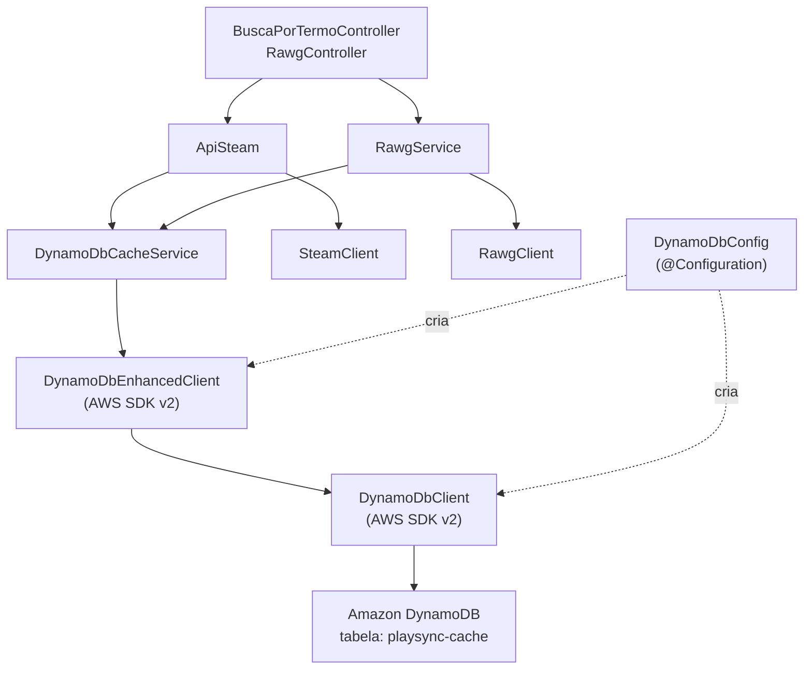
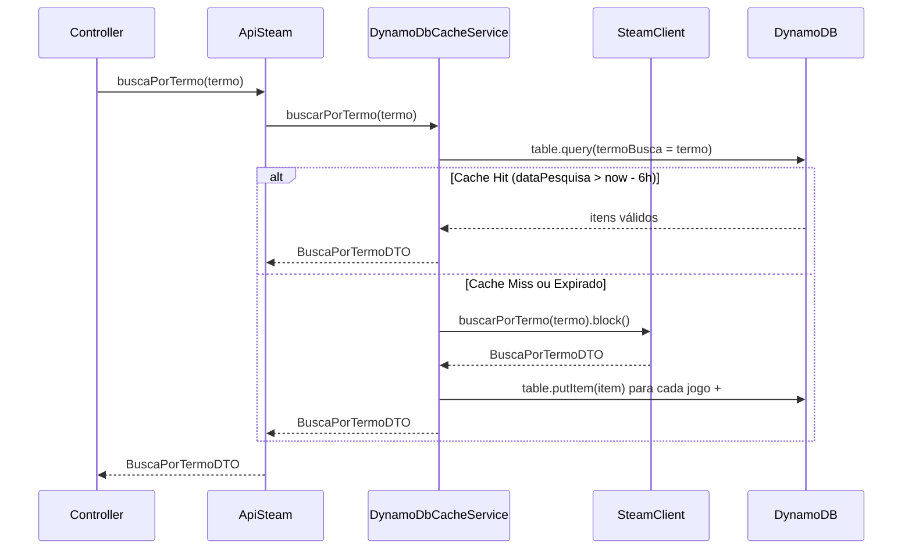

# Design Document — dynamodb-migration

## Overview

Migração cirúrgica da camada de persistência do PlaySync de JPA/MySQL para Amazon DynamoDB usando **AWS SDK v2 Enhanced Client**. A abordagem usa `@DynamoDbBean` para mapeamento automático de atributos, eliminando serialização manual com `Map<String, AttributeValue>`.

O escopo de mudança é limitado a:
- `pom.xml` — troca de dependências
- `application.properties` — troca de configurações
- `config/DynamoDbConfig.java` — novo bean de configuração (Enhanced Client)
- `model/PlaySyncCacheItem.java` — novo modelo DynamoDB (substitui entidades JPA)
- `service/DynamoDbCacheService.java` — novo serviço substituto dos repositórios
- `service/ApiSteam.java` — remoção de JPA, uso do novo serviço
- `service/RawgService.java` — substituição do repositório pelo novo serviço
- Remoção de `Entities/` e `repository/`

Controllers, DTOs, clients e demais configs permanecem intocados.

---

## Architecture



**Fluxo de busca por termo (ApiSteam):**



---

## Components and Interfaces

### DynamoDbConfig

**Pacote:** `com.playsync.demo.config`

Cria e expõe os beans `DynamoDbClient` e `DynamoDbEnhancedClient`. A região é fixada em `SA_EAST_1` conforme configuração do devops. Credenciais são resolvidas automaticamente pela cadeia padrão da AWS (variáveis de ambiente, IAM role da VM, `~/.aws/credentials`).

```java
@Configuration
public class DynamoDbConfig {

    @Bean
    public DynamoDbClient dynamoDbClient() {
        return DynamoDbClient.builder()
                .region(Region.SA_EAST_1)
                .build();
    }

    @Bean
    public DynamoDbEnhancedClient dynamoDbEnhancedClient(DynamoDbClient client) {
        return DynamoDbEnhancedClient.builder()
                .dynamoDbClient(client)
                .build();
    }
}
```

> Credenciais não ficam no `application.properties`. A VM do devops já tem IAM role configurada — o SDK resolve automaticamente via `DefaultCredentialsProvider`.

---

### PlaySyncCacheItem (modelo DynamoDB)

**Pacote:** `com.playsync.demo.model`

Substitui as três entidades JPA (`BuscaPorTermo`, `ItensBuscadorPeloTermo`, `PrecosJogos`). Um único item representa um jogo dentro de uma busca. O item `#meta` usa o mesmo bean com apenas `termoBusca`, `idGame` e `qtdItensEncontrados` preenchidos.

```java
@DynamoDbBean
public class PlaySyncCacheItem {

    private String termoBusca;    // PK
    private String idGame;        // SK — ID do jogo ou "#meta"
    private String nome;
    private String img;
    private Double precoInicial;
    private Double precoFinal;
    private String suporteControle;
    private String dataPesquisa;  // ISO-8601: "2024-01-15T10:30:00"
    private Long ttl;             // epoch seconds (TTL automático DynamoDB)
    private Integer qtdItensEncontrados; // apenas no item SK="#meta"

    @DynamoDbPartitionKey
    @DynamoDbAttribute("termoBusca")
    public String getTermoBusca() { return termoBusca; }

    @DynamoDbSortKey
    @DynamoDbAttribute("idGame")
    public String getIdGame() { return idGame; }

    // getters/setters para todos os demais campos (sem anotações especiais)
}
```

**Regras:**
- Todos os campos precisam de getter/setter público (requisito do `@DynamoDbBean`)
- `@DynamoDbIgnoreNulls` pode ser adicionado na classe para não persistir campos nulos
- Lombok `@Getter @Setter @NoArgsConstructor` funcionam normalmente

---

### DynamoDbCacheService

**Pacote:** `com.playsync.demo.service`

Substitui os três repositórios JPA. Usa `DynamoDbTable<PlaySyncCacheItem>` do Enhanced Client.

```java
@Service
@Slf4j
@RequiredArgsConstructor
public class DynamoDbCacheService {

    private final DynamoDbEnhancedClient enhancedClient;
    private final SteamClient steamClient;

    private static final String TABLE_NAME = "playsync-cache";
    private static final long TTL_SECONDS = 21_600L; // 6 horas
    private static final String SK_META = "#meta";

    private DynamoDbTable<PlaySyncCacheItem> getTable() {
        return enhancedClient.table(TABLE_NAME, TableSchema.fromBean(PlaySyncCacheItem.class));
    }

    public BuscaPorTermoDTO buscarPorTermo(String termo);
    public List<String> findMostSearchedGameNames(LocalDateTime startDate, int limit);
}
```

**Operações DynamoDB usadas:**
- `table.query(...)` — busca por PK (`termoBusca`)
- `table.putItem(item)` — persiste/atualiza item
- `table.scan(...)` — varredura para `findMostSearchedGameNames`

---

### ApiSteam (modificado)

Remove todas as dependências JPA. Delega tudo para `DynamoDbCacheService`.

**Antes:**
```java
private final SteamClient webConfig;
private final ItensBuscadosPeloTermoRepository itensRepository;
private final BuscaPorTermoRepository buscaPorTermoRepository;
private final PrecoPorJogoRepository precoRepository;

@Transactional
public BuscaPorTermoDTO buscaPorTermo(String termo) { ... }
```

**Depois:**
```java
private final DynamoDbCacheService cacheService;

public BuscaPorTermoDTO buscaPorTermo(String termo) {
    return cacheService.buscarPorTermo(termo);
}
```

Toda a lógica de cache miss/hit/atualização/persistência migra para `DynamoDbCacheService`. O `ApiSteam` vira um delegador simples.

---

### RawgService (modificado)

Substitui `ItensBuscadosPeloTermoRepository` por `DynamoDbCacheService`.

**Antes:**
```java
private final ItensBuscadosPeloTermoRepository itensRepository;
List<String> maisSearchados = itensRepository.findMostSearchedGameNames(
    trintaDiasAtras, PageRequest.of(0, 1));
```

**Depois:**
```java
private final DynamoDbCacheService cacheService;
List<String> maisSearchados = cacheService.findMostSearchedGameNames(trintaDiasAtras, 1);
```

Nenhuma outra lógica do `RawgService` é alterada.

---

## Data Models

### Tabela DynamoDB: `playsync-cache`

| Atributo | Tipo DynamoDB | Campo Java | Descrição |
|---|---|---|---|
| `termoBusca` | S | `String termoBusca` | **PK** — termo de busca |
| `idGame` | S | `String idGame` | **SK** — ID do jogo ou `#meta` |
| `nome` | S | `String nome` | Nome do jogo |
| `img` | S | `String img` | URL da imagem |
| `precoInicial` | N | `Double precoInicial` | Preço em reais |
| `precoFinal` | N | `Double precoFinal` | Preço em reais |
| `suporteControle` | S | `String suporteControle` | `"FULL"` ou `"NULL"` |
| `dataPesquisa` | S | `String dataPesquisa` | ISO-8601 |
| `ttl` | N | `Long ttl` | Epoch seconds — expiração automática (6h) |
| `qtdItensEncontrados` | N | `Integer qtdItensEncontrados` | Apenas no item SK=`#meta` |

**Chave primária composta:** `termoBusca` (PK) + `idGame` (SK)

**TTL:** habilitado no atributo `ttl`. DynamoDB remove automaticamente itens com `ttl < now`.

**Exemplo de item de jogo:**
```json
{
  "termoBusca": "elden ring",
  "idGame": "1245620",
  "nome": "ELDEN RING",
  "img": "https://cdn.akamai.steamstatic.com/...",
  "precoInicial": 199.99,
  "precoFinal": 149.99,
  "suporteControle": "FULL",
  "dataPesquisa": "2024-01-15T10:30:00",
  "ttl": 1705318200
}
```

**Exemplo de item de metadados:**
```json
{
  "termoBusca": "elden ring",
  "idGame": "#meta",
  "qtdItensEncontrados": 5,
  "ttl": 1705318200
}
```

### Lógica de cache hit/miss/atualização

```
buscarPorTermo(termo):
  itens = table.query(termoBusca = termo).filter(idGame != "#meta")

  se itens vazio:
    → CACHE MISS: chama Steam, persiste, retorna

  se itens[0].dataPesquisa > now - 6h:
    → CACHE HIT: desserializa e retorna

  senão:
    → EXPIRADO: chama Steam, atualiza itens correspondentes, retorna
```

### Mudanças no pom.xml

**Remover:**
```xml
<dependency>
    <groupId>org.springframework.boot</groupId>
    <artifactId>spring-boot-starter-data-jpa</artifactId>
</dependency>
<dependency>
    <groupId>com.mysql</groupId>
    <artifactId>mysql-connector-j</artifactId>
    <scope>runtime</scope>
</dependency>
<dependency>
    <groupId>org.postgresql</groupId>
    <artifactId>postgresql</artifactId>
    <scope>runtime</scope>
</dependency>
```

**Adicionar (BOM + Enhanced Client):**
```xml
<dependencyManagement>
    <dependencies>
        <dependency>
            <groupId>software.amazon.awssdk</groupId>
            <artifactId>bom</artifactId>
            <version>2.25.40</version>
            <type>pom</type>
            <scope>import</scope>
        </dependency>
    </dependencies>
</dependencyManagement>

<dependency>
    <groupId>software.amazon.awssdk</groupId>
    <artifactId>dynamodb</artifactId>
</dependency>
<dependency>
    <groupId>software.amazon.awssdk</groupId>
    <artifactId>dynamodb-enhanced</artifactId>
</dependency>
```

### Mudanças no application.properties

**Remover:**
```properties
spring.datasource.url=...
spring.datasource.username=...
spring.datasource.password=...
spring.datasource.driver-class-name=...
spring.jpa.hibernate.ddl-auto=...
spring.jpa.show-sql=...
spring.jpa.properties.hibernate.format_sql=...
spring.jpa.database-platform=...
```

Nenhuma propriedade AWS é necessária — credenciais resolvidas via IAM role da VM.

---

## Correctness Properties

### Property 1: Bean DynamoDbClient criado com região SA_EAST_1

*Para qualquer* inicialização do contexto Spring, o bean `DynamoDbClient` deve ser criado com `Region.SA_EAST_1`.

**Validates: Requirements 1.2**

---

### Property 2: Round-trip de mapeamento Enhanced Client

*Para qualquer* `PlaySyncCacheItem` com dados válidos, persistir via `table.putItem` e recuperar via `table.getItem` deve produzir um objeto com os mesmos valores de `termoBusca`, `idGame`, `nome`, `precoInicial`, `precoFinal` e `suporteControle`.

**Validates: Requirements 2.2, 4.5**

---

### Property 3: Item #meta criado para toda busca persistida

*Para qualquer* termo de busca com resultados não-vazios, após a persistência deve existir um item com `termoBusca = termo` e `idGame = "#meta"` contendo `qtdItensEncontrados` igual ao número de jogos persistidos.

**Validates: Requirements 2.3**

---

### Property 4: TTL calculado como now + 6 horas

*Para qualquer* item persistido, o atributo `ttl` deve ser igual a `Instant.now().plusSeconds(21600).getEpochSecond()`, com tolerância de ±5 segundos.

**Validates: Requirements 2.4, 3.3**

---

### Property 5: Cache miss persiste N jogos + 1 item #meta

*Para qualquer* lista de N jogos retornada pela API Steam em cache miss, devem ser realizadas exatamente N+1 chamadas `putItem`.

**Validates: Requirements 3.1, 3.2**

---

### Property 6: API vazia ou nula lança 404

*Para qualquer* resposta da API Steam com lista nula ou vazia, deve ser lançada `ResponseStatusException` com status HTTP 404.

**Validates: Requirements 3.4**

---

### Property 7: Preços convertidos de centavos para reais

*Para qualquer* valor de preço em centavos retornado pela Steam, o valor persistido deve ser igual a `centavos / 100.0`.

**Validates: Requirements 3.5**

---

### Property 8: Cache hit não invoca a API externa

*Para qualquer* termo com `dataPesquisa > now - 6h`, o `SteamClient` não deve ser invocado.

**Validates: Requirements 4.1**

---

### Property 9: Atualização preserva itens sem correspondência

*Para qualquer* conjunto de itens expirados, apenas os itens cujo `idGame` apareça na resposta da API devem ser atualizados.

**Validates: Requirements 4.2, 4.4**

---

### Property 10: Agregação retorna top-N jogos mais pesquisados

*Para qualquer* conjunto de itens com `dataPesquisa >= startDate` e `idGame != "#meta"`, `findMostSearchedGameNames(startDate, limit)` deve retornar os `limit` nomes com maior contagem, ordenados decrescentemente.

**Validates: Requirements 5.3**

---

### Property 11: Fallback sem exceção quando DynamoDB retorna vazio

*Para qualquer* chamada a `findMostSearchedGameNames` que retorne lista vazia, `RawgService.getFeaturedGame()` deve retornar resultado válido via fallback RAWG sem lançar exceção.

**Validates: Requirements 5.4**

---

### Property 12: DynamoDbException retorna HTTP 503

*Para qualquer* operação que lance `DynamoDbException`, deve ser lançada `ResponseStatusException` com status HTTP 503.

**Validates: Requirements 7.1, 7.2**

---

## Error Handling

| Situação | Resposta |
|---|---|
| API Steam retorna vazio/nulo | `ResponseStatusException(404, "Conteúdo não encontrado")` |
| `DynamoDbException` em leitura | `ResponseStatusException(503, "Serviço de cache temporariamente indisponível")` |
| `DynamoDbException` em escrita | `log.error(...)` + `ResponseStatusException(503, ...)` |

**Regra:** sempre capturar `DynamoDbException` (específico do SDK), nunca `Exception` genérica.

---

## Testing Strategy

### Biblioteca de property-based testing

**jqwik** — integra com JUnit 5.

```xml
<dependency>
    <groupId>net.jqwik</groupId>
    <artifactId>jqwik</artifactId>
    <version>1.8.4</version>
    <scope>test</scope>
</dependency>
```

### Testes unitários (JUnit 5 + Mockito)

| Classe de teste | O que testa |
|---|---|
| `DynamoDbConfigTest` | Bean criado com região SA_EAST_1 |
| `DynamoDbCacheServiceTest` | Cache hit/miss, API vazia → 404, DynamoDbException → 503 |
| `ApiSteamTest` | Delegação correta para `cacheService.buscarPorTermo` |
| `RawgServiceTest` | Fallback RAWG quando cache vazio |
| `PlaysyncApplicationTests` | Context load sem erros JPA/datasource |

### Property-based tests (jqwik)

Cada property test referencia a property via comentário:
`// Feature: dynamodb-migration, Property N: <texto>`

```java
// Feature: dynamodb-migration, Property 4: TTL calculado como now + 6 horas
@Property
void ttlCalculadoCorretamente(@ForAll("itensValidos") PlaySyncCacheItem item) {
    long antes = Instant.now().getEpochSecond();
    cacheService.persistirItem("termo", item);
    long depois = Instant.now().getEpochSecond();
    long ttl = capturarTtlPersistido();
    assertThat(ttl).isBetween(antes + 21600, depois + 21600);
}

// Feature: dynamodb-migration, Property 7: Preços convertidos de centavos para reais
@Property
void precosConvertidosParaReais(@ForAll @IntRange(min = 0, max = 1_000_000) int centavos) {
    double reais = cacheService.converterPreco(centavos);
    assertThat(reais).isCloseTo(centavos / 100.0, within(0.001));
}

// Feature: dynamodb-migration, Property 6: API vazia lança 404
@Property
void apiVaziaLanca404(@ForAll @StringLength(min = 1) String termo) {
    when(steamClient.buscarPorTermo(any())).thenReturn(Mono.just(new BuscaPorTermoDTO(0, List.of())));
    assertThrows(ResponseStatusException.class, () -> cacheService.buscarPorTermo(termo));
}
```
